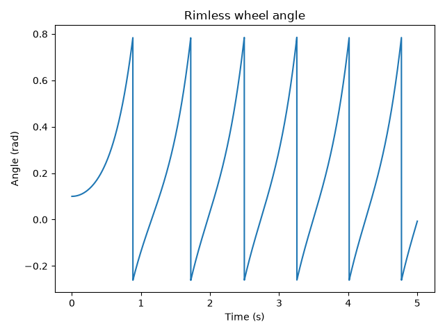
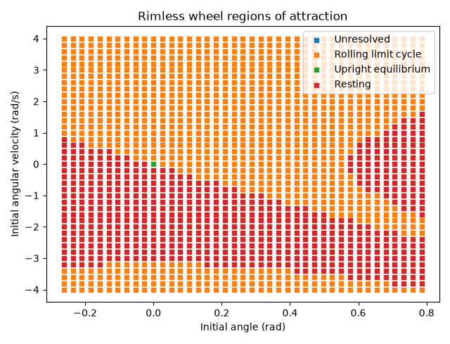
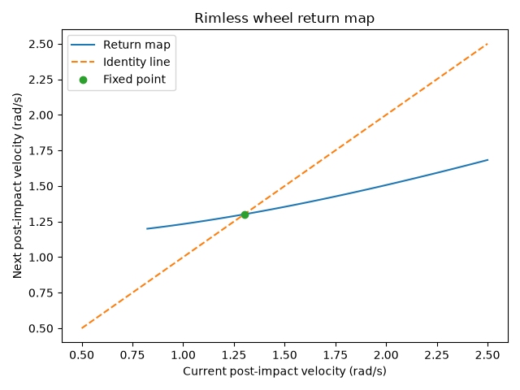
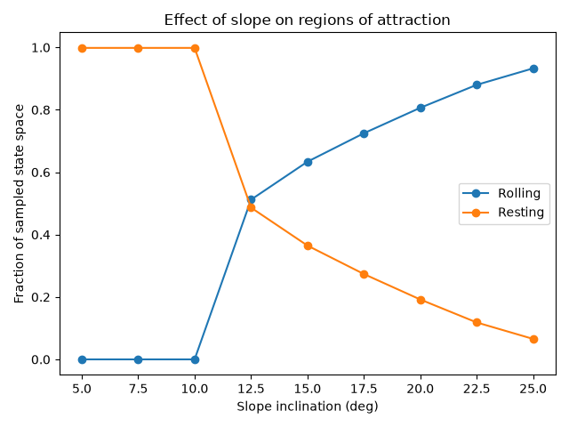
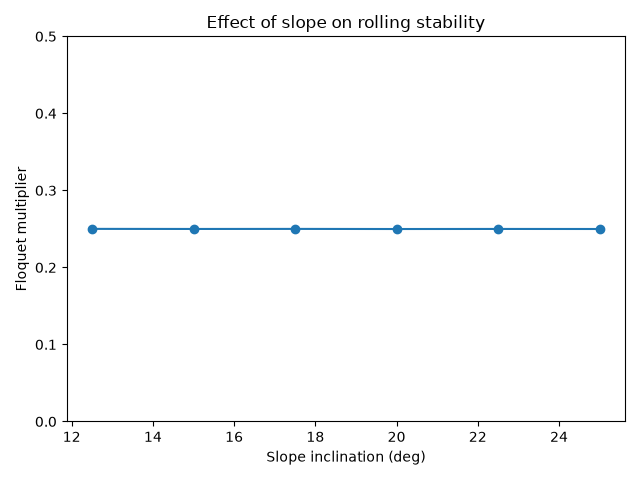
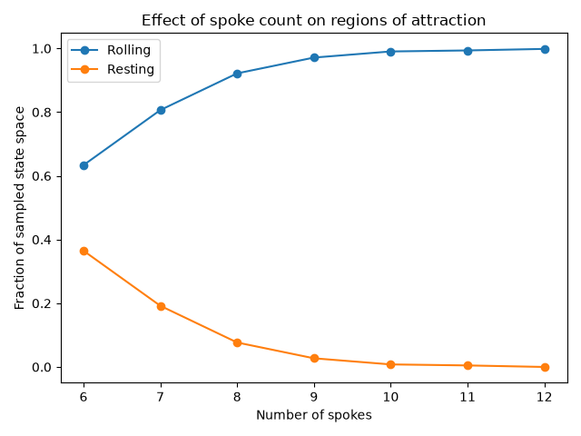
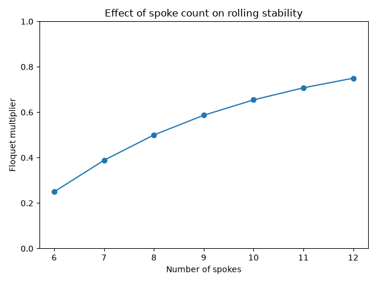

# Assignment 1 - Rimless Wheel

## Running the code

From the root of the repo:

```bash
uv run assignment_1.py
```

For the baseline case I used a 1 m spoke length, 6 spokes, a 15 degree slope, and Earth gravity.

## Sanity checks

I first checked the upright equilibrium at

$$
\theta = 0,\qquad \dot{\theta}=0
$$

Since the angular acceleration is zero here, I expected the wheel to stay still. The simulation did this.

I then released the wheel slightly downhill of vertical at

$$
\theta_0 = 0.1,\qquad \dot{\theta}_0 = 0
$$

and expected it to accelerate downhill. This also happened as expected.

For 6 spokes, the half-spoke angle is 30 degrees. With a 15 degree slope, I expected forward contact at

$$
\theta^- = 15^\circ + 30^\circ = 45^\circ = 0.785\text{ rad}
$$

and the new stance angle after impact to be

$$
\theta^+ = 15^\circ - 30^\circ = -15^\circ = -0.262\text{ rad}
$$

The angle plot shows the wheel repeatedly reaching about 0.785 rad and resetting to about -0.262 rad.



For 6 spokes, the impact rule multiplies angular velocity by

$$
\cos(60^\circ)=0.5
$$

so I also expected the angular velocity to drop by about half at each impact. This is visible in the velocity plot.


## Region of attraction

I estimated the regions of attraction by simulating a grid of initial angle and angular velocity values.

For the baseline plot I used a 41 x 41 grid over one valid stance angle range and initial angular velocities from -4 to 4 rad/s.

The main stable outcomes were:

- rolling limit cycle
- resting state

The upright equilibrium is also shown, but it is unstable, so only the exact equilibrium point stays there.



For the baseline case:

- rolling fraction = 0.626
- resting fraction = 0.373

The resting states are cases where the wheel rocks between spokes while losing energy through impacts until the velocity becomes very small.

To speed up the RoA calculation I used a timestep of 0.005 s and refined the impact time using bisection. I compared this against a timestep of 0.0025 s on the same 41 x 41 grid and got the same rolling and resting fractions to the shown precision, so I used 0.005 s for the parameter sweeps.

## Return map and Floquet multiplier

I used the post-impact state as the Poincare section. Since the angle is the same immediately after every forward impact, the return map can be represented using only angular velocity.



The fixed point is where the return map crosses the identity line. I found

$$
\dot{\theta}^* = 1.3010\text{ rad/s}
$$

This corresponds to the steady rolling limit cycle.

I estimated the local slope of the return map by perturbing the velocity slightly on both sides of the fixed point. This gave a Floquet multiplier of

$$
\lambda = 0.2499
$$

Since

$$
|\lambda|<1
$$

the rolling limit cycle is locally stable. A value near 0.25 means a small velocity error shrinks to about one quarter of its previous value each step.

## Effect of slope

I varied the slope from 5 to 25 degrees while keeping 6 spokes.



At 10 degrees and below, none of the sampled initial conditions reached sustained rolling. Rolling appeared by 12.5 degrees and its region of attraction increased as the slope increased.

| Slope | Rolling fraction | Fixed-point velocity |
| --- | ---: | ---: |
| 12.5 deg | 0.512 | 1.190 rad/s |
| 15 deg | 0.634 | 1.301 rad/s |
| 20 deg | 0.806 | 1.496 rad/s |
| 25 deg | 0.933 | 1.663 rad/s |

A steeper slope made the rolling gait easier to reach and also increased the steady rolling speed.



The Floquet multiplier stayed approximately 0.25 for every slope where a rolling limit cycle existed. This means slope had a strong effect on the RoA, but almost no effect on the local convergence rate for a fixed number of spokes.

## Effect of spoke count

I then fixed the slope at 15 degrees and varied the number of spokes from 6 to 12.



The rolling region of attraction increased strongly as more spokes were added.

| Spokes | Rolling fraction | Fixed-point velocity |
| ---: | ---: | ---: |
| 6 | 0.634 | 1.301 rad/s |
| 7 | 0.806 | 1.674 rad/s |
| 8 | 0.922 | 1.971 rad/s |
| 9 | 0.971 | 2.221 rad/s |
| 10 | 0.990 | 2.438 rad/s |
| 11 | 0.994 | 2.632 rad/s |
| 12 | 0.998 | 2.808 rad/s |

More spokes means a smaller angle between impacts, so less velocity is lost at each collision. This makes sustained rolling possible from more initial conditions.



The Floquet multiplier increased as the number of spokes increased:

| Spokes | Floquet multiplier |
| ---: | ---: |
| 6 | 0.250 |
| 7 | 0.389 |
| 8 | 0.500 |
| 9 | 0.587 |
| 10 | 0.654 |
| 11 | 0.708 |
| 12 | 0.750 |

So adding spokes increases the rolling RoA, but it also moves the Floquet multiplier closer to 1. This means the wheel is easier to get into the rolling gait, but small disturbances take more steps to decay.